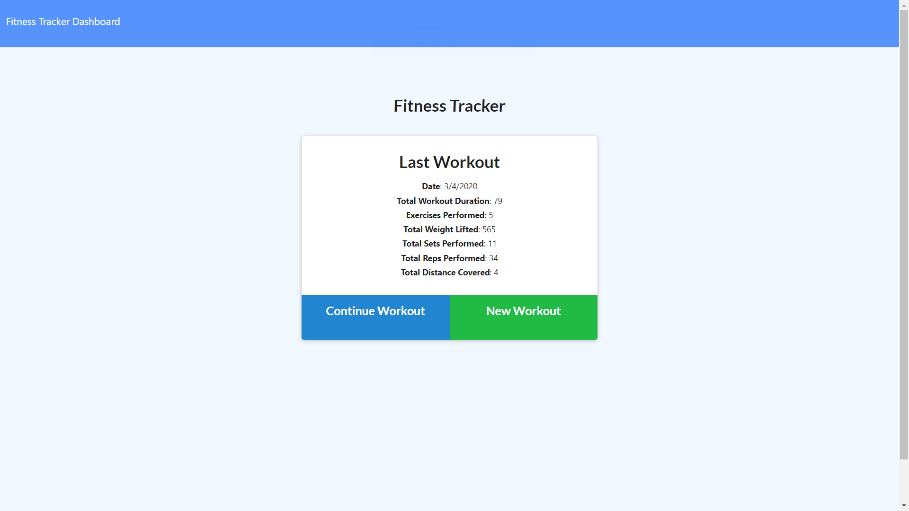
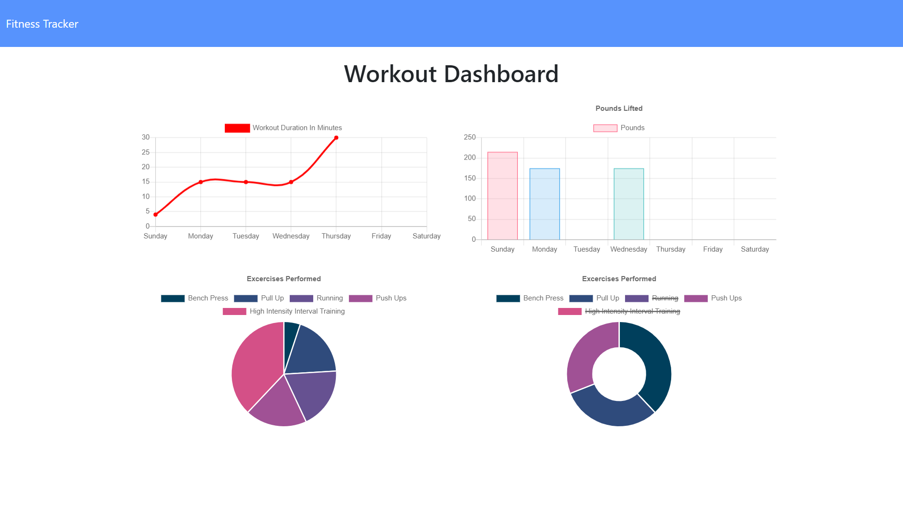

# Fitness-Tracker

Log multiple exercises in a workout on a given day. Track the name, type, weight, sets, reps, and duration of exercise. Cardio exercises track distance traveled.

## Getting Started

These instructions will get you a copy of the project up and running on your local machine for development and testing purposes

### Prerequisites

-Mongoose/Mongodb
-Express
-Morgan
-NodeJS

### Installing

-Clone or fork repo & have mongodb running 
-Go to repo directory
-Run: npm install
-Run: node server.js
-Go to localhost:3000

## Deployment

Or you can view and try the app here https://anilfitness.herokuapp.com

## Built With

Visual Studio Code & Robo-3T

## Authors

* **Anil Burak Canbolat** - https://github.com/Anil1992-rgb

## License

This project is licensed under the MIT License - see the [LICENSE.md](LICENSE.md) file for details

## Acknowledgments

* University of Oregon Coding Bootcamp

